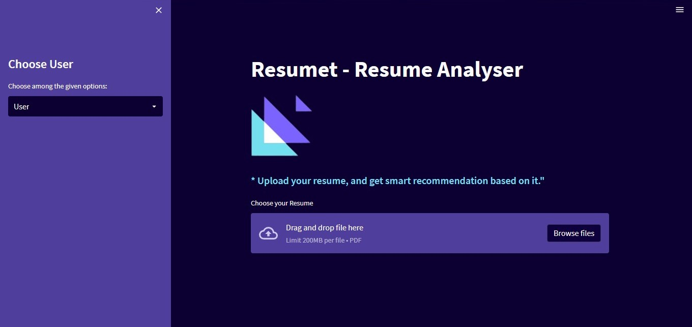
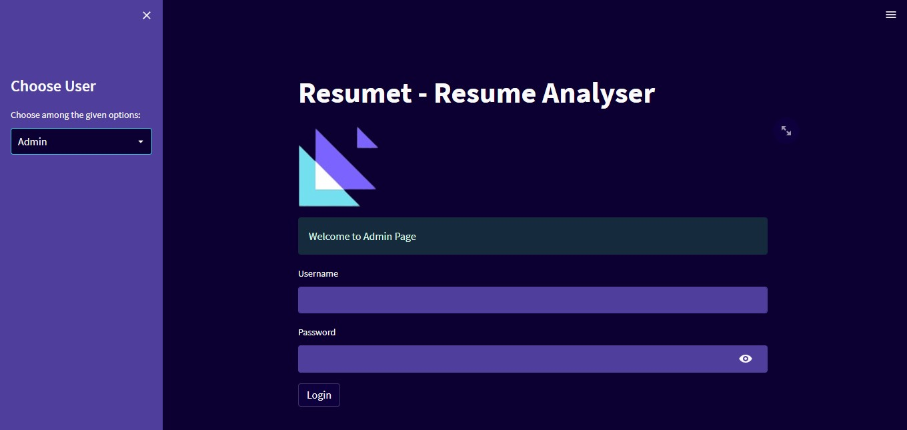

# Resumet - Resume Analyser App

[](https://www.python.org/)  
[](https://www.python.org/downloads/release/python-390/)

## Source

- Extracting user's information from the Resume, I used [PyResparser](https://omkarpathak.in/pyresparser/)
- Extracting Resume PDF into Text, I used [PDFMiner](https://pypi.org/project/pdfminer/).

## Features

- User's & Admin Section
- Resume Score
- Career Recommendations
- Resume writing Tips suggestions
- Courses Recommendations
- Skills Recommendations
- Youtube video recommendations

## Usage

- Clone my repository.
- Open CMD in working directory.
- Run following command.
  ```
  pip install -r requirements.txt
  ```
- `resumet.py` is the main Python file of Streamlit Web-Application.
- `courses.py` is the Python file that contains courses and youtube video links.
- Download XAMP or any other control panel, and turn on the Apache & SQL service.
- To run app, write following command in CMD. or use any IDE.
  ```
  streamlit run resumet.py
  ```
- `Uploaded_Resumes` folder is contaning the user's uploaded resumes.
- Admin page credentials is `jameel` and password is `#resumeT234`.

## Screenshots

## User side



## Admin Side



## Just follow☝️ me and Star⭐ my repository
